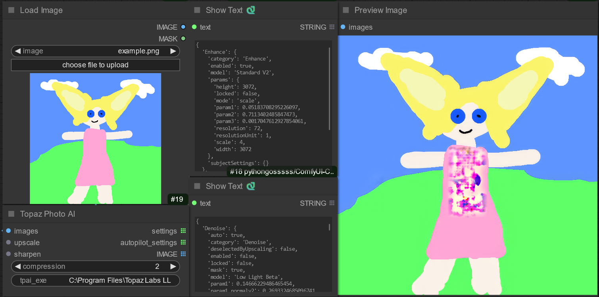

# ComfyUI Node for Topaz Photo AI (`ComfyTopazPhoto`)

Integrate Topaz Photo AI's powerful image enhancement capabilities directly into your ComfyUI workflows.

This node allows you to call the `tpai.exe` command-line interface from within ComfyUI to upscale, sharpen, denoise, and apply other adjustments offered by Topaz Photo AI.

**Note:** This node is based on the work of [choey/Comfy-Topaz](https://github.com/choey/Comfy-Topaz) and has been adapted and debugged for compatibility with newer versions of Topaz Photo AI.

## Requirements

*   **Licensed installation of Topaz Photo AI:** This node requires a working installation of Topaz Photo AI, specifically the `tpai.exe` executable.
*   **Topaz Photo AI Models:** Ensure that Topaz Photo AI has successfully downloaded the necessary AI models. You can usually verify this by running the main Topaz Photo AI application.

## Installation

1.  Clone this repository into your `ComfyUI/custom_nodes/` directory:
    ```bash
    git clone <your-repo-url> ComfyUI/custom_nodes/ComfyTopazPhoto
    ```
    (Replace `<your-repo-url>` with the actual URL of this repository)
2.  Alternatively, download the repository contents as a ZIP file and extract it into `ComfyUI/custom_nodes/ComfyTopazPhoto`.
3.  **Restart ComfyUI.**

## Usage

After installation, you will find the following nodes under the `ComfyTopazPhoto` category:

*   **`ComfyTopazPhoto` (Main Node):** This is the core node that executes Topaz Photo AI.
*   **`ComfyTopazPhoto Upscale Settings`:** Connect this node to the `upscale` input of the main node to enable and control upscaling.
*   **`ComfyTopazPhoto Sharpen Settings`:** Connect this node to the `sharpen` input of the main node to enable and control sharpening.

### Inputs (Main Node)

*   `images`: The input image(s) to process.
*   `tpai_exe`: **Required.** The full path to your `tpai.exe` executable (e.g., `H:\\Program Files\\Topaz Labs LLC\\Topaz Photo AI\\tpai.exe`).
*   `compression`: PNG compression level (0-10, default: 2).
*   `upscale`: (Optional) Connect the output of the `ComfyTopazPhoto Upscale Settings` node here.
*   `sharpen`: (Optional) Connect the output of the `ComfyTopazPhoto Sharpen Settings` node here.

### Inputs (Settings Nodes)

*   `enabled`: Set to `true` to enable this enhancement (Upscale or Sharpen).
*   `model`: Select the specific AI model to use for the enhancement.
*   **Other Parameters (Scale, Denoise, Deblur, Strength, etc.):**
    *   **Important:** Due to current compatibility issues with the `tpai.exe` command-line interface, setting these specific parameters **will not** override the Topaz Photo AI defaults. The node will only pass the selected `model` to `tpai.exe` when `enabled` is `true`.
    *   Topaz Photo AI will use its internal default values (or the last used values in the GUI) for these parameters when invoked via this node.

### Outputs (Main Node)

*   `IMAGE`: The processed image(s).
*   `settings`: A string containing the final JSON settings used by `tpai.exe` to process the image (excluding Autopilot settings).
*   `autopilot_settings`: A string containing the Autopilot settings detected by `tpai.exe` (if applicable, although `--override` is used when manual settings are active).

### Workflow Example

1.  Load an image using a `LoadImage` node.
2.  Create a `ComfyTopazPhoto Upscale Settings` node.
    *   Set `enabled` to `true`.
    *   Select an AI `model` (e.g., `Standard V2`).
3.  Create the main `ComfyTopazPhoto` node.
    *   Connect the `IMAGE` output from `LoadImage` to the `images` input.
    *   Connect the `upscale_settings` output from the settings node to the `upscale` input.
    *   Fill in the correct path for `tpai_exe`.
4.  Connect the `IMAGE` output of the `ComfyTopazPhoto` node to a `SaveImage` or `PreviewImage` node.
5.  Queue the prompt.

 *(Screenshot might show older node names)*

## Current Limitations & Troubleshooting

*   **Parameter Override:** As mentioned, only the `model` parameter can currently be effectively overridden via the settings nodes due to issues with `tpai.exe` CLI handling of other parameters. The node uses the `--override` flag, so Topaz Autopilot settings are replaced, but sub-parameters will use Topaz's defaults.
*   **`Could not load model` Error:** If you encounter this error in the ComfyUI console, it likely indicates an issue with the Topaz Photo AI installation itself or its model files. Ensure the main application works correctly and check Topaz Photo AI's own log files for more details (often found in `AppData\Local\Topaz Labs LLC\Topaz Photo AI\Logs`).
*   **Initial Setup:** Ensure the `tpai_exe` path is correct.

## Future Development (TODO)

*   Investigate future `tpai.exe` versions for improved CLI parameter handling to re-enable full parameter control.
*   Potentially expose other Topaz Photo AI features available via CLI (Denoise, Adjust Lighting, etc.) as separate settings nodes.
*   Refine error handling and reporting.

